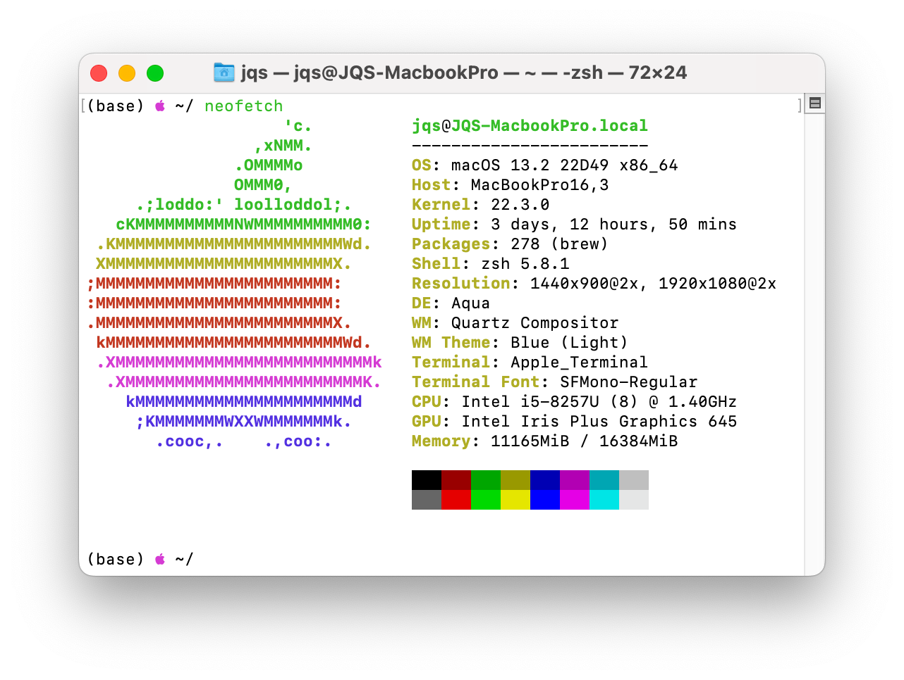

## 开发环境

**系统环境**



**Rust版本**

```bash
stable-x86_64-apple-darwin (default)
rustc 1.76.0 (07dca489a 2024-02-04)
```

**Cargo版本**

```bash
cargo 1.76.0 (c84b36747 2024-01-18)
```

## 开发目标

当前已实现的功能：

- 监控阿里云、腾讯云竞价实例的释放状态并发送警报
- 监控本地服务器的状态，如果失去连接则发送警报，通常是网络断连、突然断电等导致的情况
- 支持飞书 Webhook 消息

后面应该会添加更多功能，比如监控系统资源占用情况，集成更多的通知以及支持Webhook回调等。

使用Rust开发该项目是为了动手掌握Rust的基础知识并能上手实际的项目，即“实践是检验真理的唯一标准”。

## 项目配置

### 环境变量

- `CONFIG_PATH` 配置文件路径，不填则默认为空配置
- `SERVER_PORT` 服务端监听端口，默认为9080

### 配置文件

该项目基于 [TOML](https://toml.io/en/) 配置文件配置运行状态，示例为：

```toml
name = "ikun101"
provider = "AliCloud"
interval = 10

[alert.feishu]
webhook = "https://open.feishu.cn/open-apis/bot/v2/hook/:"
secret = ":"

[keepalive]
period = 30

[keepalive.server]
key = "hello"
num = 2

[keepalive.client]
uri = "ic://default:hello@172.16.101.10:9080"
```

| 参数                 | 描述                                                         | 必填 | 默认          |
| -------------------- | ------------------------------------------------------------ | ---- | ------------- |
| name                 | 实例名称                                                     | 否   | “”            |
| provider             | 服务器类型，有：`AliCloud` - 阿里云实例，`TencentCloud` - 腾讯云实例，`LocalHost` - 本地服务器 | 否   | `LocalHost`   |
| interval             | 查询竞价实例状态的间隔，单位为秒                             | 否   | 10            |
| alert                | 集成的警报类型，当前支持飞书[自定义机器人](https://open.feishu.cn/document/client-docs/bot-v3/add-custom-bot) | 否   |               |
| alert.feishu.webhook | 飞书机器人webhook地址                                        | 是   |               |
| alert.feishu.secret  | 飞书机器人密钥                                               | 是   |               |
| keepalive            | 心跳检测，包括客户端和服务端。同一个运行实例支持同时开启客户端和服务端 | 否   |               |
| keepalive.period     | 心跳间隔，单位为秒                                           | 否   | 30            |
| keepalive.server.key | 服务端预设的密钥                                             | 否   | “”            |
| keepalive.server.num | 服务端看门狗支持每个客户端缺勤的次数，看门狗每 `keepalive.period` 秒巡查一次 | 否   | 4（大概2min） |
| keepalive.client.uri | 服务端连接串                                                 | 是   |               |

服务端连接串的格式为：

```
ic://default:{key}@{host}:{port}
```

- `ic://` 为固定字段，基于TCP协议，取自 `interrupt-callback` 首字母
- `default` 为默认用户名
- `key` 为配置的服务端密钥，可不填，默认为空
- `host` 为服务端地址
- `port` 为TCP服务端运行的端口，可不填，默认为 `9080`，取自 `interrupt-callback` 字母的数量

例如：

```
ic://default@172.16.101.10            // 密钥为空，默认为9080端口
ic://default:hello@172.16.101.10:7788 // 密钥为hello，端口为7788
```

### 测试

当前只含有单元测试代码。

```bash
cargo test
```

## 源码结构

```bash
.
├── alert
│   └── feishu.rs
├── alert.rs
├── config.rs
├── keepalive.rs
├── main.rs
└── spot.rs
```

- `main` 为程序入口，核心实现是根据配置文件在子线程中创建对应的服务，包括监控竞价实例、创建TCP客户端、TCP服务端
- `config` 模块定义了程序使用到的所有配置的结构，以及如何加载配置。配置文件格式为  [TOML](https://toml.io/en/) 
- `alert` 模块为集成的所有警报
- `spot` 模块对应不同云平台的竞价实例的查询接口
- `keepalive` 为TCP客户端和服务端的实现

